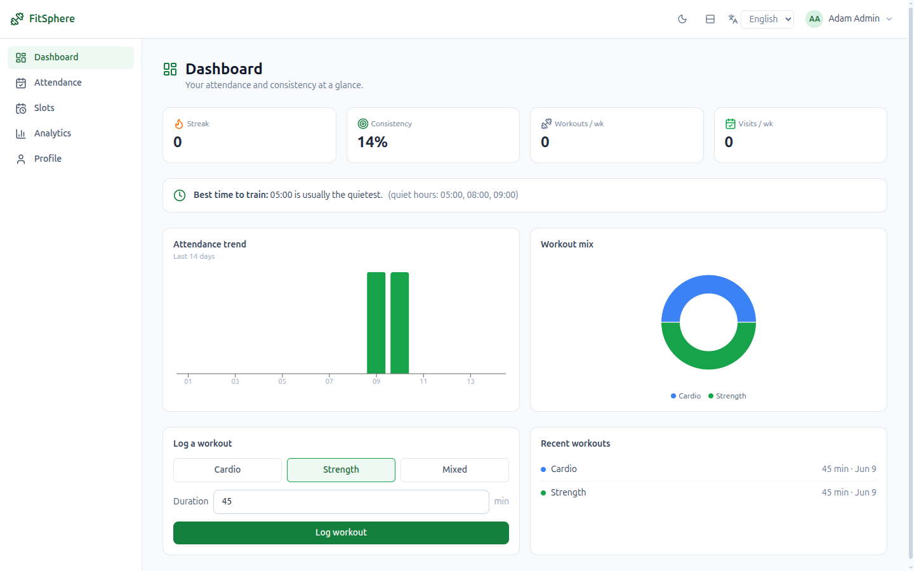
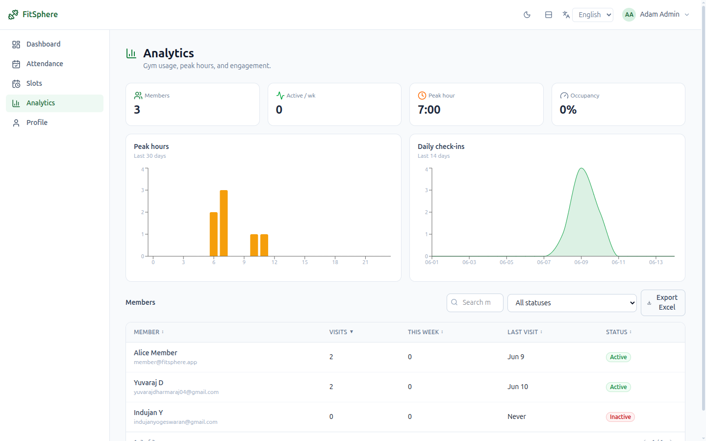
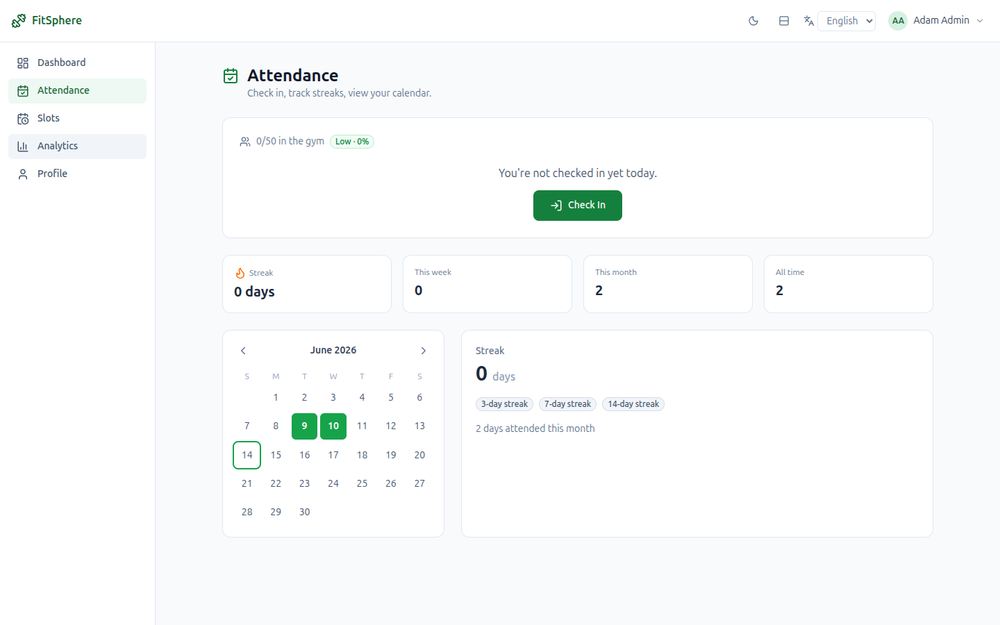
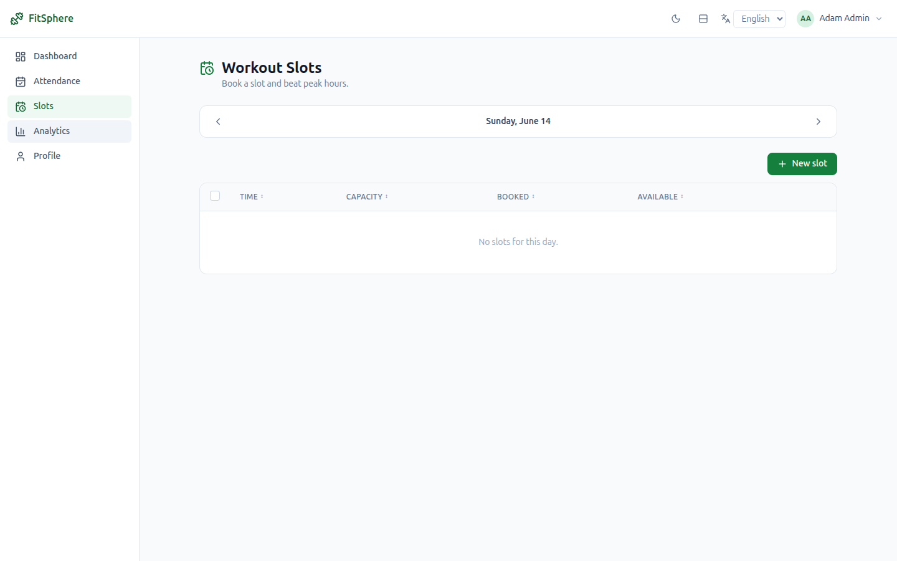

# FitSphere

A full-stack gym attendance, occupancy & engagement platform — built as a
production-style demonstration of a modern **React + Node + MongoDB** stack with
role-based access control.

> **Live demo:** https://fitsphere-two.vercel.app
> **Demo logins** (password `password123`): `member@fitsphere.app` · `trainer@fitsphere.app` · `admin@fitsphere.app`

## Why FitSphere

Most gym systems stop at memberships and billing. FitSphere focuses on the gaps
that actually affect retention: **crowd management, workout consistency, and
member engagement** — surfaced through live occupancy, attendance streaks, and
data-driven dashboards.

## Features

- 🔐 **JWT authentication** — self-built, bcrypt-hashed, with access + refresh
  token rotation and a revocable token store
- 👥 **Role-based access control** — Member, Trainer, Admin — enforced in API
  middleware and the service layer
- ✅ **Attendance & streaks** — one-click check-in/out, 3/7/14-day streaks,
  calendar view
- 📊 **Live gym occupancy** — real-time crowd level (Low / Medium / High / Full)
  derived from active check-ins, with capacity-based rules
- 🗓️ **Slot booking** — capacity-limited workout slots
- 📈 **Dashboards** — member progress + admin analytics (peak hours, trends)
- 🗒️ **Trainer feedback** — weekly notes in a timeline, role-gated
- 🌐 **Localization (i18n)** — multi-language UI with `Intl` formatting
- ⚡ **Optimistic updates & smart caching** — via TanStack Query, with request
  cancellation (AbortController) and debounced search

## Screenshots

> Drop PNGs into `screenshots/` with these names and they'll render here.

| Member Dashboard | Admin Analytics |
|---|---|
|  |  |

| Attendance & Streaks | Slot Booking |
|---|---|
|  |  |

## Tech Stack

| Layer    | Technology |
|----------|------------|
| Frontend | React, Vite, TypeScript, Tailwind CSS, TanStack Query, React Router, react-i18next, Recharts |
| Backend  | Node.js, Express, TypeScript |
| Database | MongoDB (Mongoose) — MongoDB Atlas |
| Auth     | JWT (access + refresh), bcrypt |

## Architecture

```
fitsphere/
├── client/   # React + Vite + TypeScript SPA
└── server/   # Express + TypeScript REST API
    └── src/
        ├── config/      # env loading
        ├── lib/         # mongoose connection
        ├── models/      # Mongoose schemas
        ├── middleware/  # auth (JWT + role guards), error handling
        ├── utils/       # jwt helpers
        └── modules/     # feature modules (controller → service → model)
```

The backend follows a **controller → service → model** split per feature module,
with Zod validation at the request boundary.

## Getting Started

### Prerequisites
- Node.js 20+
- A MongoDB connection string (free [MongoDB Atlas](https://www.mongodb.com/atlas) cluster works great)

### 1. Server
```bash
cd server
npm install
cp .env.example .env          # then paste your MongoDB Atlas URI + set JWT secrets
npm run seed                  # creates demo accounts
npm run dev                   # http://localhost:4001
```

### 2. Client
```bash
cd client
npm install
npm run dev                   # http://localhost:5173
```

## License

[MIT](./LICENSE) © 2026 Yuvaraj Dharmaraj
